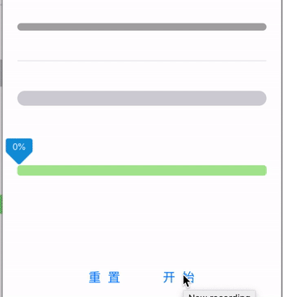

# GradientProgressView


## 一个简单的进度条控件

####  示例图



- 支持设置纯色进度条、渐变进度条
- 支持设置进度条的圆角
- 支持设置进度条的内间距
- 支持自定义高度、背景颜色
- 支持设置动画时长、动画时间函数
- 支持监听进度的更新回调

### 要求

- Swift 5.0
- Xcode 11
- iOS 8.0+

### 使用

设置圆角

```swift
//设置进度条圆角
progressView.progressCornerRadius = 5
```

设置内间距

```swift
//设置内间距
progressView.progressEdgeInsets = UIEdgeInsets(top: 4, left: 5, bottom: 4, right: 5)
```

设置纯色和渐变色

```swift
//设置纯色和渐变色
progressView1.progressColors = [.green]
progressView2.progressColors = [.green, .red]
```

设置动画时间时长

```swift
//动画时间
progressView.animationDuration = 1
```

设置动画时间函数

```swift
//动画时间函数
progressView.timingFunction = CAMediaTimingFunction(name: .easeInEaseOut)
```

设置动画更新回调

```swift
//动画更新回调
progressView.progressUpdating = {[unowned self] progress, frame in
    //在这里可以获得当前的进度百分比和进度条的frame
    print(progress)
    print(frame)
}
```

设置进度

```swift
//设置进度
progressView.setProgress(0.8, animated: true)
```

### 集成

##### CocoaPods

```ruby
pod 'KFGradientProgressView'
```

##### Swift Package Manager

```swift
dependencies: [
    .package(url: "https://github.com/moliya/GradientProgressView", from: "1.3.0")
]
```

